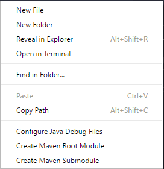
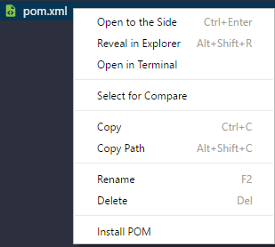
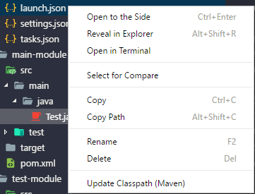

# JVM Build Menu

This project aims towards simplifying building modules within VSCode which allows for simpler
and more accurate linting.

This project is best used with [vscode-javac](https://github.com/georgewfraser/vscode-javac) and [javaVSCode](https://github.com/DonJayamanne/javaVSCode)

## Using

* Create a project by right clicking on the tree and creating a
  root module or submodule. You can also click 'Configure Java Debug Files'
  to create launch.json, settings.json, and tasks.json in the .vscode folder.

* Right click on an XML file (pom.xml) and choose 'Install POM.'
  This is usually done after adding a new dependency in a pom.xml file.

* Right click on .vscode/launch.json and choose 'Update Classpath (Maven)'
  This is usually done after adding a new dependency in a pom.xml file.

## License

[MIT](LICENSE.md)
